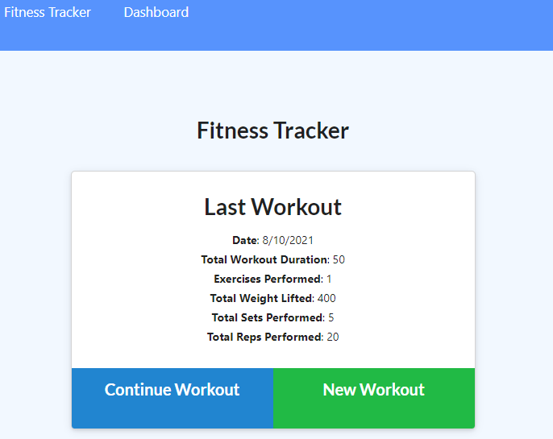

# Workout Tracker

[](https://opensource.org/licenses/IPL-1.0)

<p>
    
    
    
    
    
</p>

## Table of Contents

- [**Description**](#-description)
- [**Installation**](#-installation)
- [**Usage**](#-usage)
- [**License**](#-license)
- [**Demo Video**](#-demo-video)
- [**Questions**](#-questions)
- [**Contributing**](#-contributing)
- [**Author**](#-author)

## 📑 Description

As a person who loves fitness, don't you want to track the schedule of your workouts and exercises in one application?

It's time to use **Workout Tracker** to fulfill your needs!

**CLICK THE IMAGE BELOW TO EXPLORE THE APP**  
[](https://fitness-tracker-sjp.herokuapp.com/)

## 💾 Installation

Clone my repository.

```
git clone git@github.com:zzangu0215/workout-tracker.git
```

Type and run **`npm i`** in your terminal to install the following dependencies.

- **`express`**
- **`mongoose`**
- **`morgan`**

## 💻 Usage

To test my app locally, type the following command to your terminal.

- **`npm start`**

Then, visit `http://localhost:3000`

## 🛠 License

This application is covered by the **ISC** license.

## 🎬 Demo Video

If you want to watch the demo video for how to use the application, check out the video below.

**CLICK THE PLAY BUTTON**  
[](https://youtu.be/AeKqxNhZxGY)

## 🔥 Contributing

**Israel Magallon**

- Portfolio: [**Portfolio**](https://imagallon.github.io/portfolio1.1/) (to be updated)
- Email: **izzymagallonworks@gmail.com**
- Github: [**GitHub**](https://github.com/imagallon)

## 😎 Author

🖐 If you have any question about me or my project, feel free to contact me!

- **Jun Park**
  - Portfolio: [**Portfolio**](https://portfolio-v2-sjp.herokuapp.com/) (to be updated)
  - Email: **tajo0215@gmail.com**
  - **Github**: [**zzangu0215**](https://github.com/zzangu0215)
